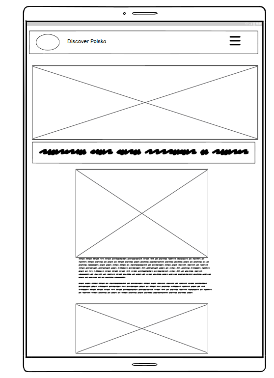

<h1>Discover Polska</h1>

For this capstone project, the aim was to develop a full stack website built using the Django web framework. Discover Polska is a travel blog suitable for female or solo travellers wanting to explore locations in Poland, and read comments from other travelers to get their opinion or other useful advice regarding specific locations, cities or attractions.  This website provides users with; a blog with the top attractions in Poland, comments section, and about page for users to gin insight into who the writer is (I used myself in this case as I felt it was more authentic) and a contact us form, which encouraged users, other travellers or travel companies to get in contact in order to set up collaboration, share some more hidden locations to see and other requestes. 

With its current features and any future developments, the hope is that this travel blog will become a valuable travel tool for thise wanting to explore Poland or solo travel while showcasing modern web development techniques.

The website was built using Django, HTML, CSS, and JavaScript, computer/laptop-based first, rather than mobile, however using Bootstrap ensured wide accessibility & responsiveness across various devices and platforms.

This project can be found at: https://capstone-project-mk-6cfa95e93b99.herokuapp.com/ 

## Table of Contents
- [User experience (UX)](#user-experience-ux)
   * [Objectives](#objectives)
   * [Target audience](#target-audience)
   * [User stories](#user-stories)
- [Technologies](#Technologies)
- [Design](#Design)
* [Color Palette](#ColorPalette)
* [Icons & Images](#Icons&Images)
- [Features](#Features)
  * [Logo and navigation bar](#logo-and-navigation-bar)
   * [Hero image](#hero-image)
   * [Django alert messages](#django-alert-messages)
   * [Clear indication as to whether the user is logged in or out at all times](#clear-indication-as-to-whether-the-user-is-logged-in-or-out-at-all-times)
   * [Quote](#quote)
   * [A list of blog posts](#a-list-of-blog-posts)
   * [See an individual blog post in detail](#see-an-individual-blog-post-in-detail)
   * [Pagination](#pagination)
   * [About page](#about-page)
   * [Contact form](#contact-form)
   * [Sign in form](#sign-in-form)
   * [Register form (Sign up)](#register-form-sign-up)
   * [Sign out page](#sign-out-page)
- [Deployment](#Deployment)
- [Issues & Bugs](#Issues&Bugs)
- [Validation](#Validation)
- [Future Improvements](#FutureImprovements)
- [Acknowledgements](#Acknowledgements)

## User Expereince (UX)

### Objectives
* Create an engaging travel aid for travel enthusiasts who want to explore Poland
* Provide a user-friendly interface for finding information on travel locations
* Ensure responsiveness across different screen sizes

### Target Audience
* Female or Solo travellers looking to explore more of Europe
* Users who are specifically wanting to explore more of Poland, including city breaks, historical monuments or nature. 
* Travel agencies/ companies who wish to get in contact to collaborate, offer funding for travel or users who want to suggest other locations not listed in the blog. 

### User Stories

GitHub Copilot provided useful suggestions for user stories, though some required adjustment to meet project goals.

The user stories for this project were taken from the Code Institute Code-Star blog project. Due to my limited experience and lack of confidence in using Python/Django, I chose to not go 'overboard' with my User Stories like in previous projects, becasue I did want to build the habit of maintaining agile methodology in using them and keeping on track. 

This prompt generated the necessary user stories applicable to our project design, and it was further clarified to include the must-have, shold-have and could-have MOSCoW labels. 

* As a user, I want to modify or delete a comment I made on a blog post
* As a user, I want to be able to register an account on the blog using an email or username. 
* As a user I can leave comments on a post so that I can be involved in the conversation
* As a user / Admin I can view comments on an individual post so that I can read the conversation
* As a user, I can view a paginated list of posts so that I can select which post I want to view.
* As a user, I want to be able to access the blog on any device (laptop or mobile).

## Technologies

This project was created using the following technologies:

* Django, including:
    * summernote==0.8.20.0
    * allauth==0.57.2
    * crispy-forms==2.3
* Javascript for functionality and interactivity
* HTML5 for structure
* CSS3 for styling and responsiveness (Bootstrap)
* Python, including:
    * asgiref==3.8.1
    * cloudinary==1.41.0
    * dj-database-url==0.5.0
    * gunicorn==20.1.0
    * oauthlib==3.2.2
    * psycopg==3.2.1
    * PyJWT==2.9.0
    * python3-openid==3.2.0
    * requests-oauthlib==2.0.0
    * sqlparse==0.5.1
    * urllib3==1.26.19
    * whitenoise==5.3.0

This ensured the project was in line with the project requirements as set out by Code Institute but also ensured that the travel blog was responsive, functional and accessible to our target audience. 

### Database

- [PostgreSQL from Code Institute](https://dbs.ci-dbs.net/ "link to postgresql from code institute") was used as the PostgreSQL database for this project. 

### AI

To further supplement the website design, I included the following AI technology and websites to aid in the creation of the initial design ideas and to debug any issues within the code.

* #### [Perplexity.ai](#https://www.perplexity.ai) 
* #### [Chat GPT](#https://chatgpt.com/)
* #### Co-pilot (Github)

Also, certain parts of the code were used from the CodeStar Blog walkthrough by Code Institute, to build the foundation of the project using Django (this is for the models i.e. Post, Comment and to ensure working CRUD functionality). The contact us form was developed from the walkthrough's Collaboration Form, however the contact us form was adapted as a custom model for this project, including additional, custom features relating to subject and destination.  

### Websites

* [Favicon](#https://favicon.io/)
* [Font Awesome](#https://fontawesome.com/)
* [FreePik](#https://www.freepik.com/premium-vector/karate-logo-with-red-sunset_24779702.htm)
* [Cloudinary](https://cloudinary.com/") was used to host images
* [Code Institute](#https://learn.codeinstitute.net/courses/course-v1:CodeInstitute+SBIFSPAI_PS+1/courseware/0bf0a428e5be490abd9442fffa403666/2ef05be5acd14e05bcd9723c29f0f6b2/)
* [Tinypng](#https://tinypng.com/) - For picture compression
* [Bootstrap](#https://getbootstrap.com/)
* Inspiration for design came from previous CI Bootcamp students' projects, including:
    * [Statement Beauty](#https://statement-beauty-ec9472f892b1.herokuapp.com/)
    * [Nature-blog](#https://github.com/helproudman/nature-blog?tab=readme-ov-file#testing)
* [Heroku](https://id.heroku.com/login "link to Heroku login") was used to deploy the project.
* [Google Chrome Developer Tools](https://developer.chrome.com/docs/devtools/overview/) was used for lighthouse testing, debugging and consistently checking responsiveness
* [W3C Markup Validator](https://validator.w3.org/) was used to validate all live html
* [Jigsaw CSS Validator](https://jigsaw.w3.org/css-validator/") was used to validate CSS code
* [JS Hint](https://jshint.com/) was used to validate JavaScript code
* [Code Institute Python Linter](https://pep8ci.herokuapp.com/) was used to validate all python code
* [Lucid Chart](#https://lucid.app/) was used to create the Entity relationship Diagram for this project.
* [Wix] was also used to generate a logo for my blog.
* [Coolors]

## Database Schema

### Entity relationship Diagram
In the screenshot below, the ERD showcases that the User has a relationship to Post and Comment and Comment also has a relationship with both User and Post. 

## Design 

### Wireframes

Prior to starting the project, I designed prospective wireframes using [Balsamiq](#https://balsamiq.com/wireframes/) to have an idea of the blog's design, layout and feature placement. Ultimately, depsite some minor changes, the project remained closely aligned with the inital wireframes. 

#### Laptop view

 

#### Mobile view

 

#### Tablet view

### Color Palette & Color contrast 
 
The color scheme for this blog was inspired by a blog template from Wix, which inspired a nature-based color palette of green, cream/brown/gold. This was meant to inspire calmness, relaxation and for the user's eye to be drawn to the pictures on the blog posts. Using this approach was intended to not be overbearing on the user and not overwhelm with too many colors and information. 

The initial color palette from Coolers was Hazy Hues, with the exception of the font color. 

The initial text color of choice was #C0895C however this resulted in a low WAVE score (low contrast), espcially for users with issues with vision. 

Therefore, it was changed to the initial color pallete from hazy hues. However, it is being kept for future developments, as an alternative if the green background color could be altered slightly to make the contrast more effective.

### Icons & Images
The logo for this project was intended to be memorable and inspiring calmness, and it was generated by the Wix free logo designer. The intended color scheme was checked alongside the initial Hazy Hues palette to see if it matches, and ultimately the green color was taken from the logo to make it seamless. 

## Features
### Logo and navigation bar

A responsive navigatoin bar is in place for this blog. While the website was desgined for a computer/laptop view first, it is responsive across mobile devices through a burger icon, which has a dropdown menu including 'Blog', 'About', and the 'logout/login/register' options respectively. This burger icon appears on tablet view too. 

Additionally the logo, when clicked, redirects the user back to the home page (esentially the blog). See screenshots below. 

#### Monitor navigation bar

### Hero image

For my hero image, I used a Bootstrap automatic carousel with 4 aesthetic images of natural locations in Poland. This was chosen in order to add more animation and 'liveliness' to the website, keeping the user engaged and interested. Slides 1 and 4 also have messages on the images to draw the eye and resonate with the users. 

### Django alert messages
Everytime a change is made, there is an alert message; whether that is logging in/ out, when the user makes, edits or deletes a comment there is an automatic message ('Your comment is awaiting approaval' etc. )

 
 

### Clear indication as to whether the user is logged in or out at all times
The base.html file is responsible for displaying a "You are logged in as username" or "You are not logged in" depending on the boolean state of authentication.
Below is a screenshot of when the user is logged in. 

 

### A list of blog posts
For ease of access, the user has a clear visual of all the blog posts; Individual blog posts are displayed under one another on mobile screens or 6 on each page on a laptop/desktop. Each blog post has an individual image to draw attention, the author and an excerpt of the blog post for user to get a quick gauge of whether it is of interest to them. 

 

### See an individual blog post in detail
When a blog title or excerpt is clicked the post detail.html is rendered displaying a default image that is on all pages (same in every blog post), but also a mast head underneath the hero image with the blog title, author and date of publishing. Underneath this is the entire blog text/content as well as a comment count, comments section and a form to add your own comment if you are a logged in user.

 

### Pagination
Pagination makes a long list of blog posts more manageable for users. It is comprised of 'next' and 'prev' buttons as well as a count of the pages available to view. This is to make users aware of how many pages they will need to click through ahead of time, rather than having them click endlessly. Six blogs are shown per page on this website.

 

### About page
The user does not need to be logged in to view the About Me page. It includes an image of a Polish location to link to the admin's polish heritage and refer to the point of the blog. The about content explains the origin of the author, the point of the blog (travel locations in Poland and advice) and encourages the user's independent exploration. 
Underneath this is a contact us form targeted at both travel agencies/ other bloggers and users to get in contact with thier own experiences or other locations they think are worth visiting in Poland. 

 

### Custom Model: Contact us form
This is located at the bottom of the about me page and any requests are also visible in the Django administration panel. This is my custom model of choice, the initial code basis was take from the CodeStar walthrough project, however for the purposes of this project, it was adapted to be a contact request form, with the users name, email, subject, message and destination (that they are referring to or are wanting to explore further). Only the name, message and email fields are mandatory due to communication purposes. 
 

### Sign in form
This is a crispy form that asks for username and password and offers a 'remember me' option for ease of access in the future. 
   

### Register form (Sign up)

### Sign out page
The signout page confirms the user's actions to sign out of the blog: 'Are you sure you would like to sign out?'
   

   ### Quote
   This quote section is located underneath the hero image and before the blog list. It is designed to act as a break between the two sections so that the overall page does not look cluttered to the user. 

 

## Deployment
The site was created using the Code Institute template and deployed to Heroku. The steps to deploy are as follows:

* Install the gunicorn python package and create a file called 'Procfile' in the repo's root directory
* In the Procfile write 'web: gunicorn lunar_lists.wsgi'
* In settings.py add ".herokuapp.com" to the ALLOWED_HOSTS list
* In settings.py add 'https://*.herokuapp.com' to CSRF_TRUSTED_ORIGINS list, git add, commit and push to github
* Navigate to the Heroku dashboard

Create a new Heroku app
* Give it a name and select the region 'Europe' Navigate to settings tab and scroll down to Config Vars
* Click 'Reveal Config Vars'
* Add the following keys: key = DATABASE_URL | value = (my secret database url) key = SECRET_KEY | value = (my secret key) Navigate to Deploy tab
* Connect to GitHub and select the repo 'lunar-lists'
* Scroll down to 'Manual deploy' and select the 'main' branch
* Click 'Deploy Branch'

The live website for this project can be found at: https://capstone-project-mk-6cfa95e93b99.herokuapp.com/

## Deployment
- **Platform:** Heroku, with the blog being created using the Code Institute Template. 
- **High-Level Deployment Steps:** 
  1. Clone the repository
  2. Set up the Heroku environment with a PostgreSQL database.
  3. Configure environment variables for sensitive data (e.g., secret keys).
  4. Deploy using Heroku Git or GitHub integration.
- **Verification and Validation:**
  - Tested the deployed application against the development environment for consistent functionality and design.
  - Verified accessibility using tools such as Lighthouse and manual testing.
- **Security Measures:**
  - Sensitive data is stored in environment variables in the env.py file - this includes the secret key, database URL and Cloudinary URL .
  - DEBUG mode is disabled [Set to False] in the production environment to enhance security.

## AI Implementation and Orchestration

## Issues and Bugs
One of the key issue during development was Heroku deployment. Repeatedly an error would pop up when the project was deployed, regarding static files. Having troubleshooted using copilot, ensured all the files were in place by going back to the Code Star blog walthought from Code Institute, the error was resolved by installing the psycopg2-binary package rather than the psycopg2 package.  

 ## Code Validation

Testing and validation of this blog were carried out throughout the course of the project. This included regular debugging and testing using the Dev Tools provided within Chrome Browser, utilizing Copilot & Perplexity alongside using validation testing to address any code lines which needed fixing.

### HTML W3C
No errors were returned when passing the HTML code through the official [W3C validator]. For this project however, rather than passing through the entire project link, it was necessary to copy and paste the HTML code from the deployed 'view page source', into the validator via direct text input.

This is due to the fact that most pages require user authentication and the HTML vlaidator would throw errors if only the URL was used. 

#### CSS validation

When passing through the official [Jigsaw validator](#https://jigsaw.w3.org/), the direct CSS code also returned no bugs or errors. 

#### Javascript 

The validation for the javascript used in this blog [in the fixtures/posts.json file] returned no issues, only messages regarding ES6 which for this project is acceptable. 

### Lighthouse testing
Initial lighthouse testing of the blog in Chrome Devtools revealed a 78% performance rating, which is quie low but this may be due to image sizing. In the initial lighthouse assessment, the score was even lower due to larger image sizes for the blog thumbnails/post images. To improve this, the images were compressed using Tinypng.com.

However, after making some adjustments to the python file configurations (more detailed in the section below), the lighthouse rating for performance increased to 92%, making the blog overall a lot more accessible, responsive and thought-out. 

Unfortunately, the best practices ratign remained at 59% in both lighthouse reports, which, while still in the acceptable zone for lighthouse testing, still offers room for further improvement and adjustment in terms of aligning with modern website practices. 

However, I am still very happy about the 95% accessibility rating [still firmly in the 'green zone' for lighthouse], which means that it may recieve more consumer traffic due to being easy to use, accessible and still relatively quick in loading content. 

#### Future adjustments to further improve performance
- For future interations of this project, the post images will be compressed further to assess their impact on the lighthouse score. 
- Having delved into the issues for the low rating, one key issue was the lack of HTTPS. There was an attempt to rectify this issue, however it does require a more in-depth knowledge of mixed contect, which I currently do not posses and am eager to rectify. 
- The use of third-party cookies was also flagged, however this appeared to be in relation to the use of cloudinary, which was introduced by Code Institute and is therefore asusmed to not be relevant to this project at this point in time. 

### WAVE Accessibility validation
When the project was put through the WAVE validation, it returned some contrast errors, alt-image errors and highlighted the repeatability of some of the links. The contrast was changed following a contrast checker revealed a low score for the intended color palette, all the images in my project had relevant alt-descriptors and the numbered pagination links were removed, leaving only the PREV and NEXT buttons.

However, there remains 1 issue and 1 warning for the final project, which includes a missing H1 tag and some unclear color on the pagination buttons. I utilized copilot to try to fix these issues, however they remain as small bugs to fix in the next iteration of working on this project.

### CI Pep8 Linter 
All python code was tested using the [CI Python Linter](#https://pep8ci.herokuapp.com/). 

When initially testing the main settings.py, models.py and admin.py documents they returned some design errors (mainly white space errors) however these were corrected relatively quickly. However it was interesting to note that were some discrepancies between CI Python Linter (pep8's expectations) and co-pilots output when the error was questionned. 

When this testing was repeated on all following python files, the discrepencies were gradually reduced due to recieving initial PEP8 feedback, and recieving an explanation of the error and it's requirements from co-pilot in order to accurately integrate the necessary changes. 

## Manual Testing

### Notifications and feedback testing for comments

| Action                                                    | Notifications and feedback for comments                | Does it work as expected? |
| --------------------------------------------------------- | ------------------------------------------------------ | ------------------------- |
| Logged out and looking at comments                        | It should say "log in to leave a comment"              | PASS                      |
| Submit a comment                                          | Comment submitted and awaiting approval                | PASS                      |
| Delete a comment                                          | Comment has been deleted!            | PASS                      |
| Edit a comment                                    | Click a button and you are redirected to the text box | PASS                      |                  |
| When edit button is clicked                               | The word submit changes to update                      | PASS                      |
| Edit a comment successfully                               | Comment Updated! Notification appears                  | PASS                      |

### Notifications and feedback testing for collaboration form

| Action                         | Notifications and feedback for comments                                 | Does it work as expected? |
| ------------------------------ | ----------------------------------------------------------------------- | ------------------------- |
| Submit a collaboration request | Thanks for getting in contact! We will aim to get in touch as soon as possible. | PASS                      |

### Notifications and feedback testing for register, signin and signout

| Action   | Notifications and feedback for signin and out | Does it work as expected? |
| -------- | --------------------------------------------- | ------------------------- |
| signin   | Successfully signed in as username.           | PASS                      |
| signout  | You have signed out.                          | PASS                      |
| register | Successfully signed in as username.           | PASS                      |

### Notifications and feedback testing for admin panel
| Action                                                | Notifications and feedback for comments                                                         | Does it work as expected? |
| ----------------------------------------------------- | ----------------------------------------------------------------------------------------------- | ------------------------- |
| When collaboration request is marked as read in admin | The collaborate request “Collaboration request from username” was changed successfully.         | PASS                      |
| When a comment has been approved in admin             | The comment “Comment 'test' by 'username'” was changed successfully.                            | PASS                      |
| When a comment is deleted by admin                    | Successfully deleted 1 comment.                                                                 | PASS                      |
| When more than 1 comment is deleted by admin          | Successfully deleted 2 comments.                                                                | PASS                      |
| When a blog post is confirmed in admin                  | The blog 'title' was changed successfully. | PASS                      |
| When a blog is deleted by admin                    | Successfully deleted 1 blog post.                                                                 | PASS                      |
                                                           | PASS                      |

### Testing all links and buttons on blog
|    | clickable link                                         | what does it do?                                              | does it work as expected? |
| -- | ------------------------------------------------------ | ------------------------------------------------------------- | ------------------------- |
| 1  | clickable Discover Polska logo in top left of screen | returns to blog/homepage                                   | PASS                      |
| 2  | navbar blog link                                       | brings user to blog page                                      | PASS                      |
| 3  | navbar about link                                      | brings user to about page                                     | PASS                      |
| 4  | navbar register button                                 | brings user to signup page                                    | PASS                      |
| 5  | navbar login button                                    | brings user to login page                                     | PASS                      |
| 6  | navbar logout button                                   | brings user to a signout page                                 | PASS                      |
| 7  | clickable blog title                                   | sends user to post detail page                                | PASS                      |
| 8 | clickable exerpt                                       | sends user to post detail page                                | PASS                      |
| 9 | next button                                            | sends user to next page                               | PASS                      |
| 10 | prev button                                            | sends user to previous page                           | PASS                      |
| 11 | footer facebook icon                                   | sends user to facebook login                                  | PASS                      |
| 12 | footer instagram icon                                  | sends user to instagram login                                 | PASS                      |
| 13 | footer x/twitter icon                                    | sends user to x/twitter                                      | PASS                      |
| 14 | post detail edit button                                | changes submit to update and populates comment box            | PASS                      |
| 15 | post detail delete button                              | sends user to a defensive are you sure page                   | PASS                      |
| 16 | post detail submit button                              | submits a comment for approval                                | PASS                      |                 |
| 17 | collaborate submit button                              | submits the collaborate form                                  | PASS                      |

## Responsiveness

- Responsiveness of features for this blog site were tested using Chrome DevTools and across different devices using friends and family co-operation.

- All features were tested for the intended look and responsiveness on mobile (320px), iphone & Android mobiles (425px), tablet (768px) and across a HP 14-inch laptop (1024px) & an Acer desktop (1440px). As the blog site was designed laptop first, it's features and responsiveness was continuosly tested on larger laptop and desktop views first, followed by different mobile screen sizes. 

- All features passed responsiveness testing and looked good on all devices mentioned. 

- See responsive feature testing results in the table below.

| item to check for responsiveness                  | index | about | post detail logged out | post detail logged in | sign up page | sign in page | logout page | edit booking page | delete booking page | delete comment page |
| ------------------------------------------------- | ----- | ----- | ------------- | ---------------------- | --------------------- | ------------ | ------------ | ----------- | ----------------- | ------------------- | ------------------- |
| navbar                                            | PASS  | PASS       | PASS                   | PASS                  | PASS         | PASS         | PASS        | PASS              | PASS                | PASS                |
| hero image                                        | PASS  | PASS         | PASS                   | PASS                  | PASS         | PASS         | PASS        | PASS              | PASS                | PASS                |
| cover text                                        | PASS  | PASS  | PASS          | PASS                   | PASS                  | PASS         | PASS         | PASS        | PASS              | PASS                | PASS                |
| Quote                                         | PASS  | PASS  | PASS          | PASS                   | PASS                  | PASS         | PASS         | PASS        | PASS              | PASS                | PASS                |
| you are logged in as                              | PASS  | PASS  | PASS          | PASS                   | PASS                  | PASS         | PASS         | PASS        | PASS              | PASS                | PASS                |
| arrangement of blogs (under each other on mobile) | PASS  | na    | na            | na                     | na                    | na           | na           | na          | na                | na                  | na                  |
| blog pictures                                     | PASS  | na    | na            | PASS                   | PASS                  | na           | na           | na          | na                | na                  | na                  |
| blog exerpts                                      | PASS  | na    | na            | na                     | na                    | na           | na           | na          | na                | na                  | na                  |
| footer                                            | PASS  | PASS         | PASS                   | PASS                  | PASS         | PASS         | PASS        | PASS              | PASS                | PASS                |
| collaboration form                                | na    | PASS                  | na                    | na           | na           | na          | na                | na                  | na                  |
| delete and edit buttons on comments               | na    | na        | na                     | PASS                  | na           | na           | na          | na                | na                  | na                  |
| submit buttons on comment form          | na    | na            | na                     | PASS                  | na           | na           | na          | na                | na                  | na                  |
| comment cards                                     | na    | na    | na            | PASS                   | PASS                  | na           | na           | na          | na                | na                  | na                  |             |
| sign up form                                      | na    | na    | na            | na                     | na                    | PASS         | na           | na          | na                | na                  | na                  |
| sign in form                                      | na    | na    | na            | na                     | na                    | na           | PASS         | na          | na                | na                  | na                  |

## Browser compatibility

 - All pages for Discover Polska were tested for 'intended appearance' and 'responsiveness' on the following browsers; Chrome,Edge and Brave. Both these categories were successful across the three different browsers. 

### Intended appearance & responsiveness on different browsers

| intended appearance  | chrome | edge | Brave |
| -------------------------------- | ------ | ---- | ------- 
| blog                             | pass   | pass | pass    |
| about                            | pass   | pass | pass    |
| post detail logged out           | pass   | pass | pass    |
| post detail logged in            | pass   | pass | pass    |
| sign up/register page            | pass   | pass | pass  |
| sign in page                     | pass   | pass | pass    |
| logout page                      | pass   | pass | pass   |
| edit comment                | pass   | pass | pass    |
| delete comment               | pass   | pass | pass   |

## Future Improvements 
When I work on this project in the future I intended to improve the styling options, improving on the Wave error of contrast colors for better visibility. Furthermore, I wish to improve the lighthouse score even more, therefore more time will be spent familiarising myself with what exactly the errors are referring to, as in some cases by limited knowledge and experience meant that more time was spent debugging than on the project itself. 
Additionally, I intend to include a interactive map (using Javascript most likely) on which users can click on the area they are interested in and the relevant blog posts will be shown. 

## Future Features
### Personable user profiles
- Users will be able to add profile images to create a personable and 'real' feel. 
- users will be able to create their own 'mini' about/profile pages so that other users can see were they have travelled to previously, what they have commented on/reviewed. 

### Direct Messaging 
- Users will be able to directly message other users to ask questions or clarification on any potential travel destinations. 

## Acknowledgements
Code, Content, Project LOs and primary learning supplied by Code Institute LMS. 

Supplemental learning resources directly used / referenced within the project:

 - [Awesome Readme Templates](https://awesomeopensource.com/project/elangosundar/awesome-README-templates)
 - [Awesome README](https://github.com/matiassingers/awesome-readme)
 - [How to write a Good readme](https://bulldogjob.com/news/449-how-to-write-a-good-readme-for-your-github-project)

All other technologies and AI programmes used as referenced and acknowledged in the technology section of this READMe. 
